Bildschirmfotos der Wallet
==========================

Aufgenommen unter Linux auf einer privaten Regtest-Kette mit Beispieldaten
(Wallets «Everyday» und «Savings»). Deshalb steht oben links *Regtest*, und das
Mining findet die Blöcke in Sekundenbruchteilen; im Testnetz dauert ein Block
mit einem Prozessorkern etwa 1 bis 2 Minuten.

| | Deutsch | Englisch |
|---|---|---|
| Übersicht mit Wert in CHF, dunkel | 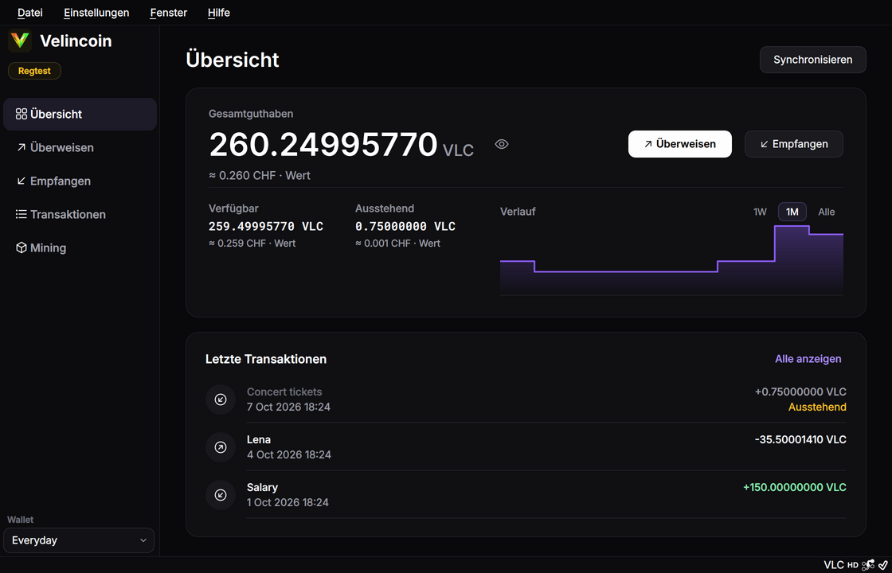 | 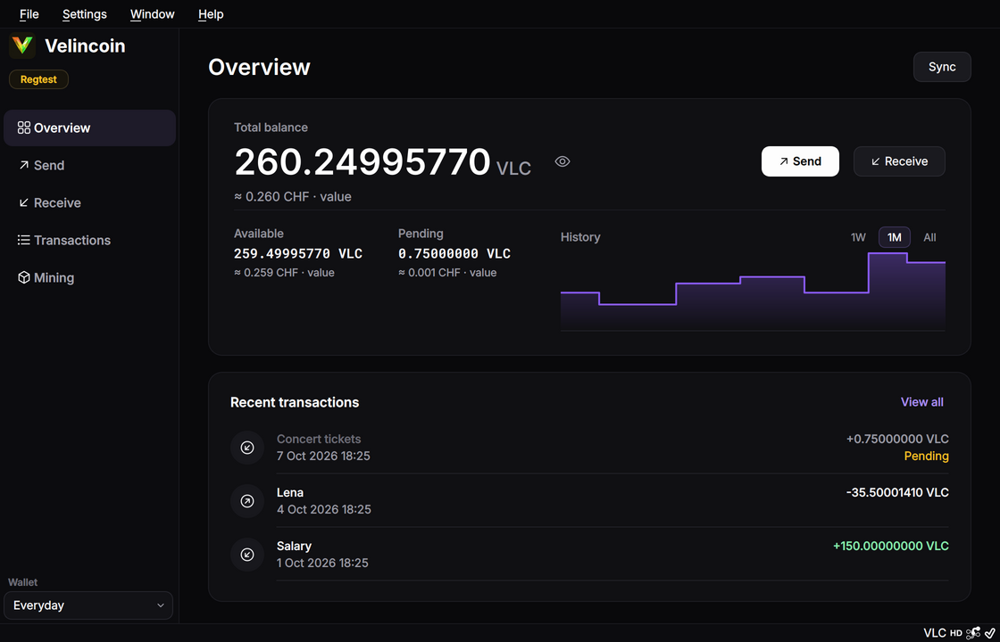 |
| Übersicht, hell | 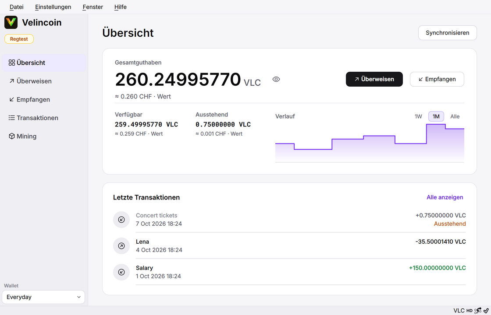 | 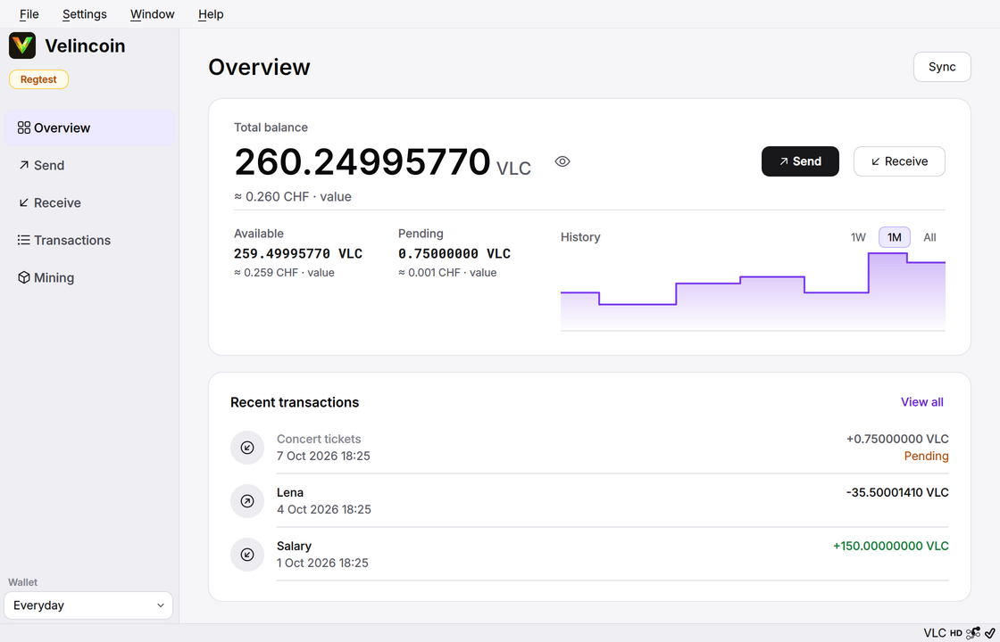 |
| Willkommensseite (keine Wallet geladen) | 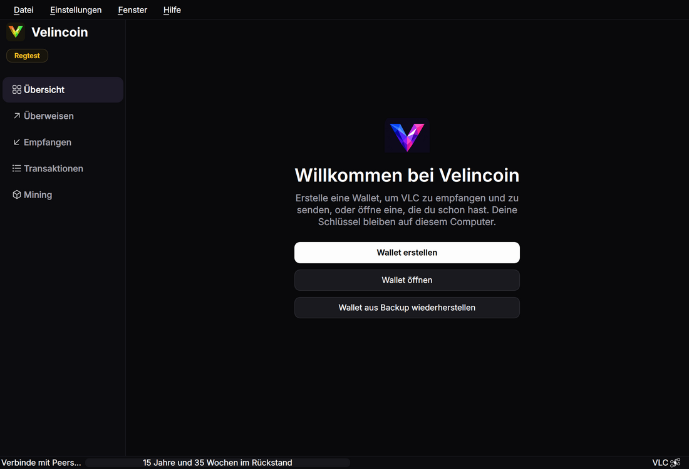 | 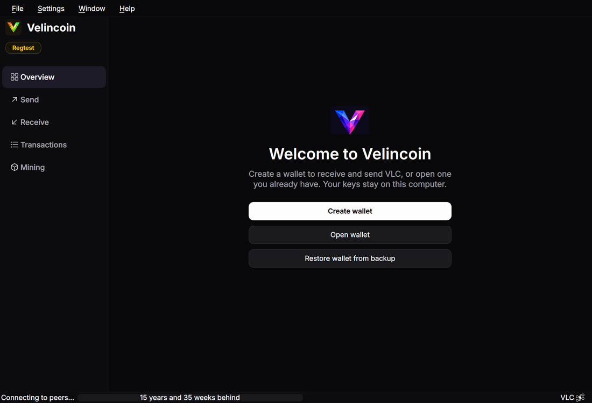 |
| Bestätigung beim Überweisen | 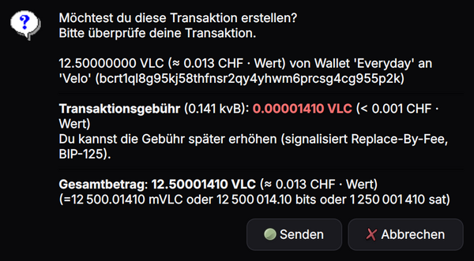 | 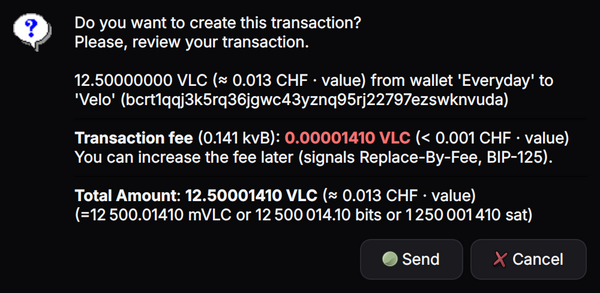 |
| Node hinzufügen | 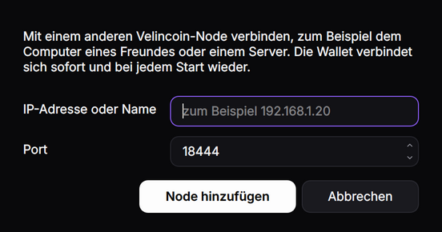 | 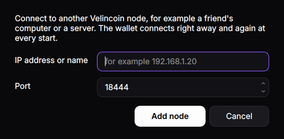 |
| Mining | 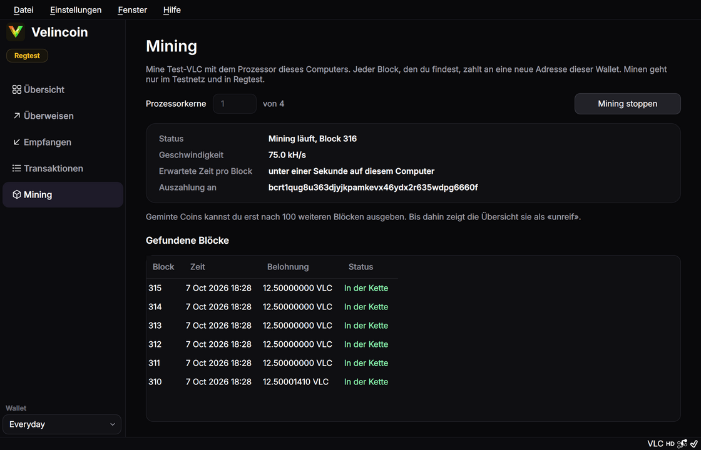 | 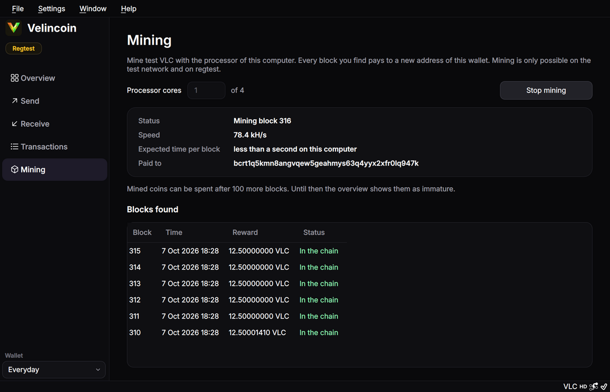 |

Das Datum («7 Oct 2026») richtet sich nach der Ländereinstellung des Systems.
Das Testsystem ist englisch eingestellt, auf einem deutsch eingestellten Computer
steht es deutsch.
